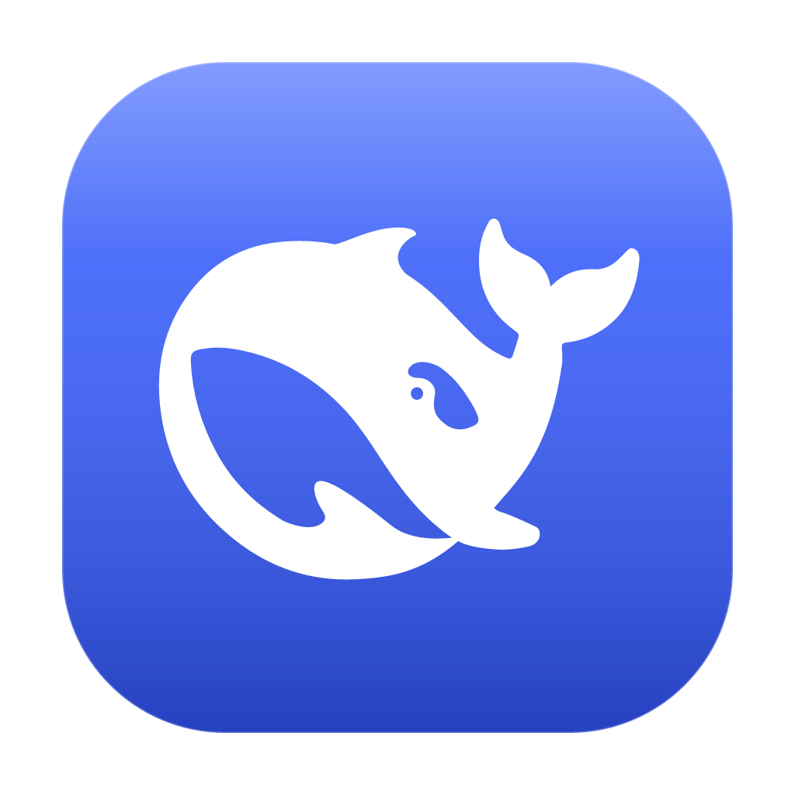

# DeepSeek Harness Desktop (macOS & Windows)

<div align="center">
  
  <h3>DeepSeek Harness 跨平台原生桌面端 (macOS / Windows / Linux)</h3>
  <p>100% 完整支持 Subagents、MCP 工具生态、LSP 代码智能与 Plan 模式的开箱即用桌面工作区</p>
  <p><strong>🔒 纯净开源 · 零隐私数据 · 无内置密钥 · 独立运行</strong></p>
</div>

---

## 📥 桌面端安装包直接下载 (Download Releases)

对于普通用户，**无需配置 Node.js 或编译环境**，直接下载预编译桌面客户端即可开箱即用：

| 平台 / 架构 | 安装包类型 | 说明 | SHA256 校验和 |
|---|---|---|---|
| **macOS (Apple Silicon, M1/M2/M3/M4)** | **[.dmg 镜像包](https://github.com/miaoxiaoqian/deepseek-harness-desktop/releases)** | 推荐，拖拽即可安装至 `/Applications` | `7131e5109dd1cc567864f9d7c586499e74061d134dd83702c59c18f72f9fa130` |
| **macOS (Apple Silicon, M1/M2/M3/M4)** | **[.zip 压缩包](https://github.com/miaoxiaoqian/deepseek-harness-desktop/releases)** | 解压直接获得 `DeepSeek Harness.app` | `ccffd13e6d8aef37a876f549db9061c738244c6505aa18950603fb3b28e26164` |

> [!TIP]
> **macOS 首次打开提示“已损坏”或“未受信任开发者”的解决方法**：
> 因开源打包采用自签名（Ad-hoc Code Signing），macOS Gatekeeper 可能会拦截。请打开终端运行以下命令即可正常启动：
> ```bash
> xattr -cr "/Applications/DeepSeek Harness.app"
> ```
> 或在访达（Finder）中按住 <kbd>Control</kbd> 键右键点击应用图标，选择「打开」。

---

## ⚡ 一键极速安装与启动（终端一键命令）

### 🍎 macOS / Linux (终端一键命令)
```bash
curl -fsSL https://raw.githubusercontent.com/miaoxiaoqian/deepseek-harness-desktop/main/install.sh | bash
```

### 🪟 Windows (PowerShell 一键命令)
```powershell
irm https://raw.githubusercontent.com/miaoxiaoqian/deepseek-harness-desktop/main/install.ps1 | iex
```

---

## 🛡️ 隐私与数据安全保证 (Privacy & Safety)

本应用在打包与开源发布时遵循严格的隐私隔离标准：
- ❌ **绝不包含任何用户 API Key**：本安装包及仓库不含有任何预置的密钥、Token 或云端凭证。首次启动时由用户在本地设置中自行填写个人 DeepSeek API Key；
- ❌ **绝不打包任何个人相片与私有素材**：不含任何本地相册文件、个人图像或历史项目；
- ❌ **数据完全本地化**：用户所有的会话历史、项目代码与配置文件均安全保存在用户本机的标准目录（如 `~/.dsh`）中，绝不上传至任何第三方服务器。

---

## ✨ 核心特性

- 🐋 **白底黑鲸官方视觉**：遵循 Apple 与 Windows Fluent 规范的原生质感图标与暗色毛玻璃（Vibrancy）沉浸式窗口；
- 🌐 **双平台开箱即用 (macOS & Windows)**：内置通用引擎引导器（Universal Engine Bootstrapper），任何人下载后自动连接或克隆官方最新引擎并运行；
- 🛡️ **红黄绿交通灯原生避让**：macOS 满屏无顶栏设计，左上角三色按钮自然融入，零遮挡；
- 🔄 **类 Codex 一键应用内热更新**：自动检测官方 GitHub 最新插件与代码提交，右下角弹窗一键无缝更新并重启，无需重新打包客户端；
- ⚡ **全局秒级唤起**：支持通过 <kbd>Option</kbd> + <kbd>Space</kbd>（Windows: <kbd>Alt</kbd> + <kbd>Space</kbd>）随时呼出与隐藏工作区；
- 📂 **原生工作区选择器**：支持 <kbd>Cmd</kbd>/<kbd>Ctrl</kbd> + <kbd>O</kbd> 随时通过系统原生文件管理器一键切换项目目录；
- 🧩 **100% 契合「一切皆插件」**：零侵入式 Cordis 微内核托管，49+ 个官方与第三方插件无损运行。

---

## 🛠️ 开发者从源码运行与构建

```bash
# 1. 克隆本仓库
git clone https://github.com/miaoxiaoqian/deepseek-harness-desktop.git
cd deepseek-harness-desktop

# 2. 安装依赖
npm install

# 3. 本地启动开发模式
npm start

# 4. 打包为分发安装包
npm run pack:dmg  # 打包 macOS (.dmg)
npm run pack:win  # 打包 Windows (.exe)
```

---

## 📄 License
MIT License. Based on DeepSeek Harness & Cordis.
